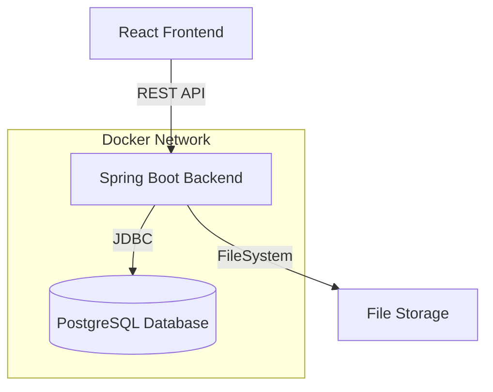

# Task Management System


A modern, full-stack task management application designed for efficient team collaboration. Built with a robust Spring Boot backend and a responsive React frontend, orchestrated via Docker Compose.

---

## Features

- **Kanban-Style Board**: Drag-and-drop tasks between "To Do", "In Progress", and "Done" columns.
- **Rich Task Details**: Create, edit, and delete tasks with priorities, due dates, and descriptions.
- **File Attachments**: Support for file uploads with size validation and preview.
- **User Assignment**: Assign tasks to specific users with visual avatars.
- **Optimistic Updates**: Immediate UI feedback for status changes.
- **Responsive Design**: Mobile-friendly interface built with Shadcn UI and Tailwind CSS.
- **Dockerized**: Fully containerized environment for consistent development and deployment.

---

## Architecture



---

## Tech Stack

### Backend
- **Framework**: Spring Boot 3.x
- **Language**: Java 17+
- **Database**: PostgreSQL 15
- **Build Tool**: Maven

### Frontend
- **Framework**: React 19
- **Build Tool**: Vite
- **Styling**: Tailwind CSS, Shadcn UI
- **State Management**: Redux Toolkit
- **Drag & Drop**: @dnd-kit

---

## Getting Started

### Prerequisites
- [Docker](https://www.docker.com/) & [Docker Compose](https://docs.docker.com/compose/) installed.

### Quick Start (Recommended)

1. **Clone the repository**
   ```bash
   git clone <repository-url>
   cd fullstack
   ```

2. **Start the application**
   ```bash
   docker-compose up --build
   ```
   *This command builds both backend and frontend images and spins up the database.*

3. **Access the Application**
   - **Frontend**: [http://localhost:5173](http://localhost:5173) used in development or [http://localhost:5173](http://localhost:5173) mapped from container.
   - **Backend API**: [http://localhost:8080](http://localhost:8080)
   - **Database**: Port `5433` (mapped from `5432`)

### Manual Setup (Development)

#### Backend
```bash
cd backend
./mvnw spring-boot:run
```

#### Frontend
```bash
cd frontend
npm install
npm run dev
```

---

## Environment Variables

The application comes pre-configured for Docker usage. 

**Backend (`backend/src/main/resources/application.properties`):**
- `spring.datasource.url`: Database connection URL.
- `server.port`: 8080 (Default).

**Docker Compose (`docker-compose.yml`):**
- `POSTGRES_USER`: `postgres`
- `POSTGRES_PASSWORD`: `postgres`
- `POSTGRES_DB`: `taskdb`

---
